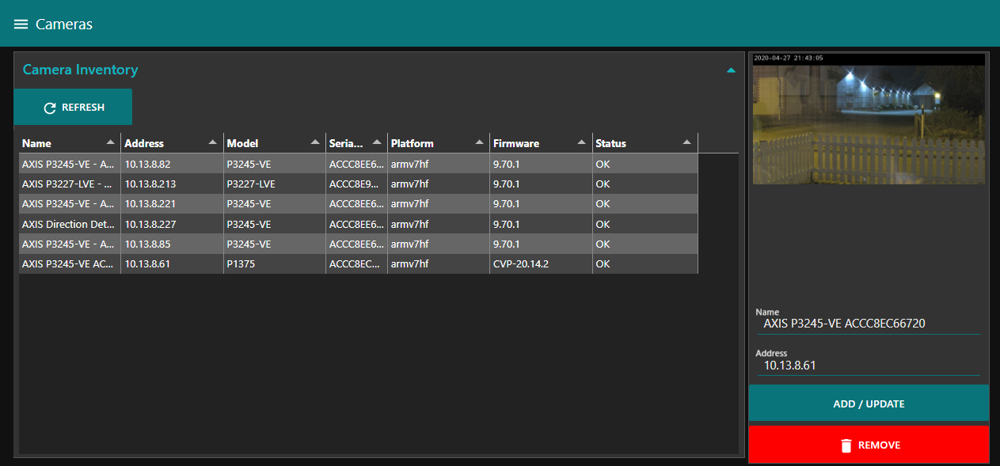
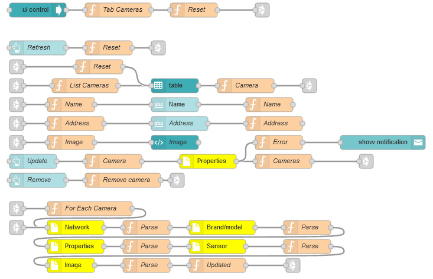

# Camera Inventory
This flow is suitable when you need to have a camera inventory in your Node-Red.  The inventory is stored in global context.  If you enable persistant storage the inventory will reamin intact event after restarting Node-Red.  To enable persistant storage you need to edit the file ./node-red/settings.js.  Remove the comments (//) on each line of the following section in settings.js.  You need to restart Node-Red after changes.
```
    contextStorage: {
        default: {
            module:"localfilesystem"
        },
    },
```

# Camera Discovery
The Axis Discovery node will find cameras on the local network segment using UPnP and/or Bonjour.  Note that discovery will not work if you are running Node-Red in a Docker Container.

# Usage
Use the dashboard to add cameras to inventory.

When you want to use a camera in e.g. a function node, add the followng
```
cameras = global.get("cameras");
if(!cameras)
  return;  //No inventory
camera = cameras["THE CAMERA SERIAL IS"]
```
If you need an array of cameras
```
var msg.payload = [];
cameras = global.get("cameras");
if(!cameras)  //No inventory
  return msg;
 
for(var serial in cameras)
 msg.payload.push(cameras[serial])
return msg;
```
For-Each-Camera, put the following in a function node
```
cameras = global.get("cameras");
if(!cameras)
  return;  //No inventory
for(var serial in cameras)
 node.send({payload:cameras[serial]})
//DO NOT return msg;
```

## Prerequisites
Before importing the flow you need to import the following nodes (Menue | Manage pallette | Install)
- node-red-dashboard
- node-red-contrib-axis-camera
- node-red-contrib-axis-discovery

Before deploying the flow you need to set the camera credentials in the Axis Camera node.  Double click the yellow node and set your camera credentials.

## Dashboard


## Flow
Copy and import the [flow](https://github.com/aintegration/flows/blob/master/camera_inventory/flow.json) to your Node-Red

