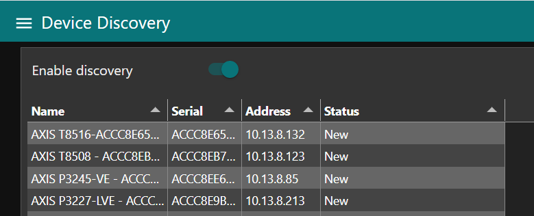
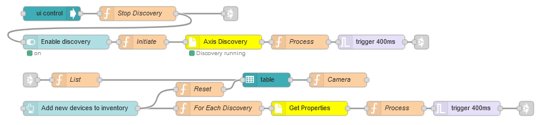

# Device Discovery

Adding a lot of devices to a Node-Red inventory can be tedious.  This flow will detect Axis Device using UPnP and Bonjour and add them in a global context store.
It is recommeded to use this flow together with flow [device_inventory](https://github.com/aintegration/flows/tree/master/camera_inventory).

## Dashboard


## Prerequisites

Before importing the flow you need to import the following nodes (Menu | Manage pallette | Install)
- node-red-dashboard
- node-red-contrib-axis-camera
- node-red-contrib-axis-discovery

The inventory is stored in global context (global.get("cameras").  You should enable persistant storage in Node-Red in order for your inventory to survice a rbeoot.
Open the file .node-red/settings.js in an editor and remove the comments (//) on each line of the following section in the file.

```
    contextStorage: {
        default: {
            module:"localfilesystem"
        },
    },
```
You need to restart Node-Red after changes.

## Flow
Copy and import the [flow](https://github.com/aintegration/flows/blob/master/device_discovery/flow.json) to your Node-Red.

Once imported you will see.


## Usage
See examples in [device_inventory](https://github.com/aintegration/flows/tree/master/camera_inventory)

