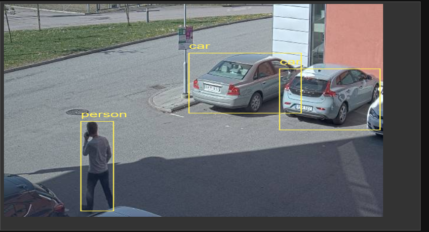
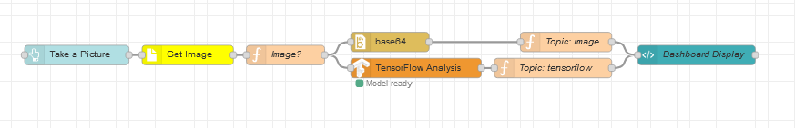

# TensorFlow Object CLassification 
It is fun to play with object classifications in images.  This flow takes a picture from a camera (triggered by a dashbaord button) and sends it to a TensorFlow node and display the result on a dashboard (see below).
You can easily replace the the dashboard button with your own troggers.  How many images/s you TensorFlow can analyze depends on the HW you are running on.

## Prerequisites
Before importing the flow you need to import the following nodes (Menue | Manage pallette | Install)
- node-red-dashboard
- node-red-contrib-axis-camera
- node-red-contrib-tfjs-coco-ssd

Before deploying the flow you need to set the camera credentials in the Axis Camera node. Double click the yellow node and set your camera credentials.
You also need to st the camera address and possibly adjust the resolution.

## Dashboard

## Flow
Copy and import the [flow](https://github.com/aintegration/flows/blob/master/tensor_flow_object_detection/flow.json) to your Node-Red

