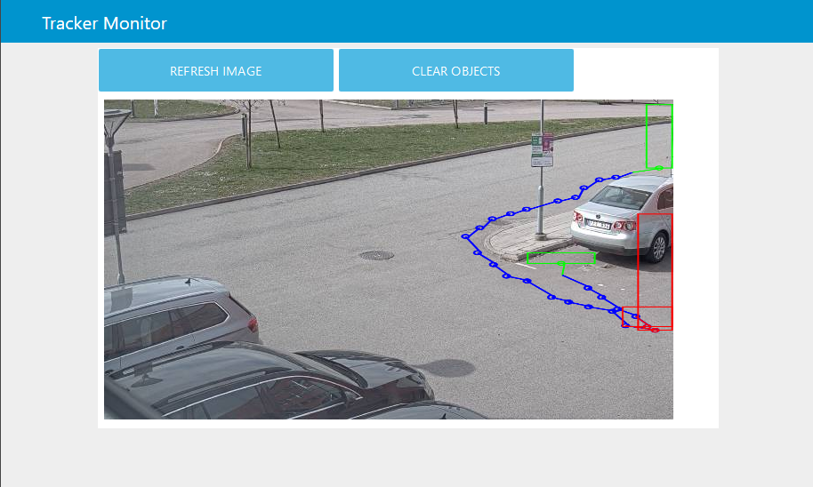

# Tracker Monitor
The [Tracker ACAP](https://github.com/pandosme/acaps/tree/master/tracker) publish motion trackers on MQTT.  This flow demonstrates how to visualize these on a dashboard.


## Requirements
1. Axis Camera with FW 8.xx or later
2. [Tracker ACAP](https://github.com/pandosme/acaps/tree/master/tracker) installed and configured on the camera
3. MQTT broker
4. node-red-dashboard installed on your Node-Red
5. node-red-contrib-axis-camera installed on your Node-Red

## Dashboard
Bounding boxes will appear on the static image.  As there is no video the data is completely anonymized.

- Green box shows where the object is first detected.
- The blue dots will show the object path
- Red box shows where the object was lost

You can refresh both the image and flush all bounding boxes.


## Flow
Copy and import the [flow](https://github.com/aintegration/flows/blob/master/trackermonitor/flow.json) to your Node-Red


## User extensions
You can easily add your own object behaviour filters by adding a function block between the MQTT subscription and Dashboard display.
The [Tracker ACAP](https://github.com/pandosme/acaps/tree/master/tracker) documentation describes all properties that can be used for filters.

Example javascript code that only displays objects moving down:
```
if( msg.payload.dy > 0 )
  return msg.payload
```
